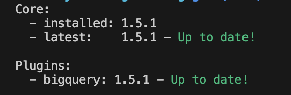

# analytics-engineering 
Building a Dimensional Data Warehouse using dbt and BigQuery. 

## Navigation

This repository contains the Use Case of a Dimensional DWH build using `dbt` and `bigquery`, it contains two folders:   
1. The folder __DL_NORTHWIND__ contains the dataset to model on dbt
2. the other folder is the name assigned to the dbt project, in this case __NT_DWH__

## dbt installation

0. Install __pyenv__ to manage Python versions and virtual environments: https://github.com/pyenv/pyenv 

1. Create a new Python environment for the dbt and its big query adapter:  

    `pyenv virtualenv dbt-bigquery`

    and upgrade pip:

    `pip install --upgrade pip`

2. Install __dbt-core__ and __dbt-bigquery__: 

    `pip install dbt-core` 
    `pip install dbt-bigquery`
    
    and check the version:

    `dbt --version` 

    

3. Initialize the dbt project and assign it a valid name. In this use case, the name is "NT_DWH" as per Northwind Traders Data Warehouse: 

    - run `dbt init NT_DWH`

    - choose __bigquery__ as db

    - choose __oauth__ as authenthication method

    - add your GCP __project_id__

